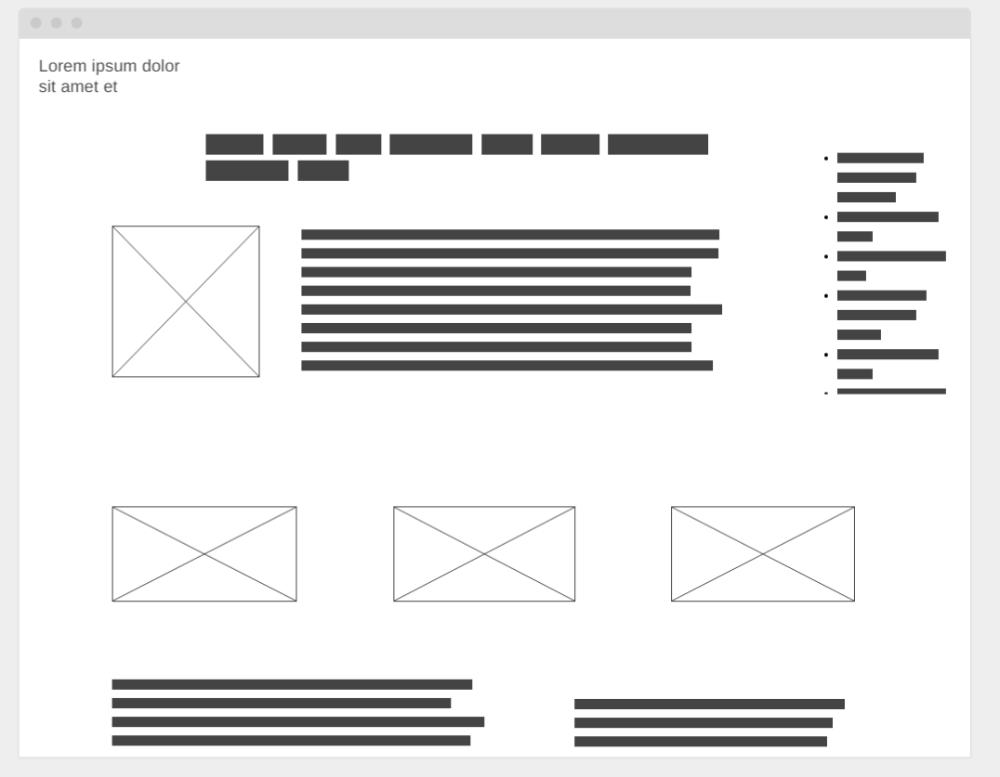

#Matt's Portfolio


##Portfolio project schedule

| Day | Deliverable | Status
|--- | --- | --- | 
| Day 1 | Project Description | Complete
| Day 2 | Wireframes / Priority Matrix / Timeline | Complete
| Day 3 | Core Application Structure (HTML, CSS, etc.) | Complete
| Day 4 | MVP & Bug Fixes | Complete
| Day 5 | Final Touches & PostMVP | Complete
| Day 6 | Present | Incomplete

### Project Decription
Create a personal Portfolio site that has a hamburger menu that follows the user down the page. Having the opening page have an animated pc with code continuously looping. Travel/Outdoor themed. *edit top menu follows user


### Wireframes



### Time/Priority Matrix

#### Functional Components

#### MVP
| Component | Priority | Estimated Time | Actual Time |
| --- | :---: |  :---: | :---: | 
| Top Menu | H | 1hr | 2hr |
| Project Previews | H | 3hr | 3hr |
| Regular Nav | H | 1hr | 1hr |  
| Working with API | H | 3hrs|  4hr | 
| Responsive | H | 3hr | 3hr |
| Social Media Icons | L | 1hr |  1hr |
| Total | H | 12-14hrs| 14hrs |


#### PostMVP
| Component | Priority | Estimated Time | Actual Time |
| --- | :---: |  :---: | :---: | 
| Project Hover | L | 3hr | -hr | 2hr |
| Animated Opening Page | H | 3hr | hr |
| Interactive Banner | M | 4hr | hr |
| Make own icon | L | 4hr | hr |
| Total | 14H | | 2hrs |


## Additional Libraries Used

 Use this section to list all supporting libraries and their role in the project. 
https://fonts.googleapis.com/css2?family=Concert+One&display=swap
https://www.flaticon.com/free-icons/html Html icons created by Pixel perfect - Flaticon
https://www.flaticon.com/free-icons/social Social icons created by riajulislam - Flaticon
## Code Snippet

Use this section to include a brief code snippet of functionality that you are proud of an a brief description  

```
function myCoolThing() {
	// here is the code to do something really cool!
```

## Issues and Resolutions

 Use this section to list of all major issues encountered and their resolution.